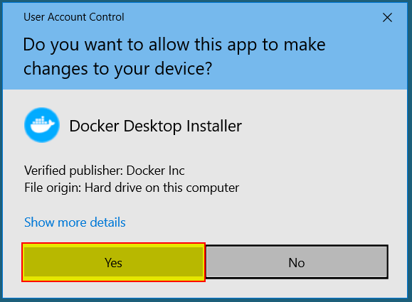
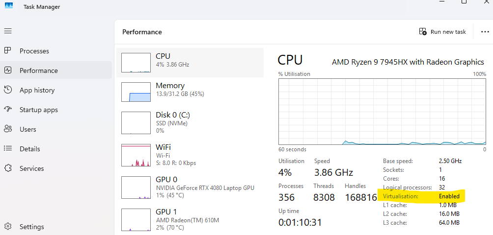

# Checks for requirements -

- Admin Rights
- Virtualization enabled
- WSL Status
- Optional Features
- Test Install

## Verify Administrator Rights
1. Press `Windows Key + R`
2. Type `cmd`
3. Press `Ctrl + Shift + Enter` (instead of just Enter)
4. UAC prompt window appears asking `Do you want to allow this app to make changes?`.

    

- **Results:**
    - ✅ If UAC appears and you can click `Yes`: You have admin rights
    - ❌ If you see `Enter administrator password` or it's blocked: You DON'T have admin rights
    - ❌ If Command Prompt opens but title bar says `Administrator`: Check if you actually clicked `Yes` on UAC

## Check if Virtualization is Enabled

1. Right-click on the taskbar
2. Select **"Task Manager"**
3. Click on the **"Performance"** tab
4. Click on **"CPU"** in the left panel
5. Look at the bottom right section for **"Virtualization"**

    

- **Results:**
    - ✅ **"Virtualization: Enabled"** = Good to proceed
    - ❌ **"Virtualization: Disabled"** = Docker won't work without IT enabling this
    - ❌ **Field doesn't appear** = May not be supported or is restricted
                
## Check if WSL 2 Can Be Installed
1. Open Command Prompt (Windows Key + R, type `cmd`, press Enter)
2. Type: `wsl --status`
3. Press Enter

- **Results:**
    - ✅ **Shows WSL version info** = WSL is already installed
    - ❌ **"'wsl' is not recognized"** = WSL not installed (will be installed during Docker setup)
    - ❌ **Error about not having permissions** = IT restrictions may block WSL
            
## Check for Software Restrictions
1. Try downloading and running a simple, safe installer (like Notepad++ or 7-Zip)
2. See if you can complete the installation

- **Results:**
    - ✅ **Installer runs and installs successfully** = No broad software restrictions
    - ❌ **Blocked or requires admin password** = Corporate restrictions in place
            
## Check Group Policy Restrictions**
1. Press `Windows Key + R`
2. Type: `gpedit.msc`
3. Press Enter  

- **Results:**
    - ✅ **Group Policy Editor opens** = You have some access to check policies
    - ❌ **"Windows cannot find gpedit.msc"** = Windows 11 Home edition (doesn't have this tool)
    - ❌ **"Access denied"** or similar = Restricted by IT
    - If it opens, navigate to:  
        - `Computer Configuration > Administrative Templates > Windows Components > Windows Installer`
        - Check if "Disable Windows Installer" or "Turn off Windows Installer" is enabled