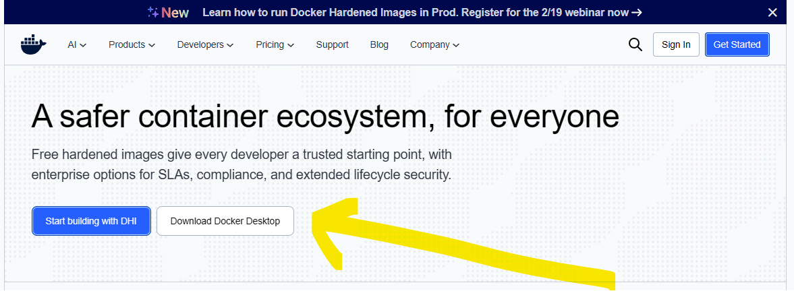
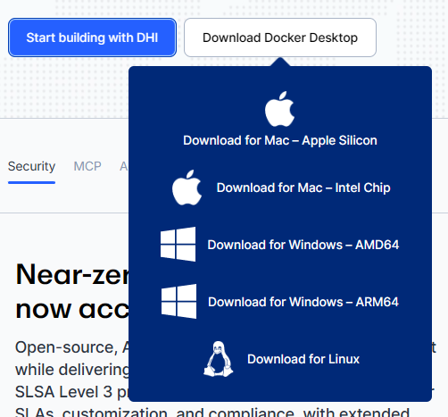
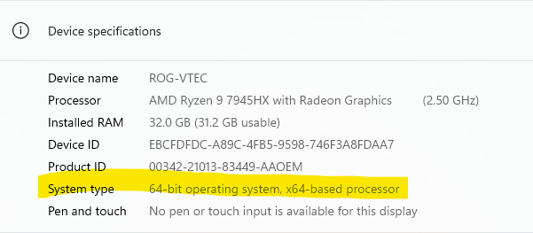
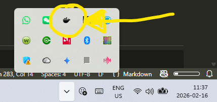

# Docker Installation Guide - Windows

## Step 0: Requirement Checks
The requirement to run Docker and required components (WSL 2):
- Windows 11 (64-bit)
- 8GB+ of RAM
- Virtualization enabled in BIOS (usually enabled by default on modern systems)

If you are uncertain, see [here](https://github.com/2diyai/agent-builder-starter-pack/blob/main/docs/install-docker-windows-requirements.md) for a detailed check list with instructions.

## Step 1: Download Docker Installer
1. **Go to [www.docker.com](https://www.docker.com)**

  
2. **Locate and click the download button for Docker Desktop for Windows.**

   

- Typically, you will have a choice between:
    - "Download for Windows - AMD64" (99% or PCs)
    - "Download for Windoes - ARM64"
    - *Note: *How do I check whether I have an AMD64 or ARM64?:*
        - *Press Windows Key, type "About", click "About your PC"*
        - *Look for "System type" or "Device specifications" section*
        - *your PC is a ARM64 type if you see:*
            - `System type: 64-bit operating system, ARM-based processor` 
        - *your PC is a AMD64 type if you see:*
            - `System type: 64-bit operating system, x64-based processor` or
            - `System type: 64-bit operating system, x86-based processor`

        

- If prompted to sign in, look for a "Continue without signing in" or direct download option
- Some browsers may show: *"This type of file can harm your computer. Do you want to keep it?"*
- Click **"Keep"** or **"Yes"** - this is expected for .exe installer files

## Step 2: Locate downloaded installer file and running it
1. **Find the downloaded `"Docker Desktop Installer.exe"` file**
    - **Option A**: 
        - Open File Explorer (the folder icon on the taskbar or press Windows Key + E)
        - Click on "Downloads" in the left sidebar
        - Look for a file named `Docker Desktop Installer.exe` with a Docker whale icon  
    - **Option B**: 
        - Click on the download notification in the browser
        - Click "Open file" or "Show in folder"

2. **Double-click on the `Docker Desktop Installer.exe` file to open it**
    - The Windows User Account Control (UAC) Prompt appears:

        ```
        User Account Control
        ─────────────────────
        Do you want to allow this app to make changes 
        to your device?
        
        Docker Desktop Installer.exe
        Verified publisher: Docker Inc
        
        [Yes]  [No]
        ```
        - Click **"Yes"** - this is required to install Docker Desktop
        - *Notes:*
            - *Why it appears:*
                - *Windows requires administrator permission to install software*
    		- *I don't have administrator rights - what happens?*
                - *The installation cannot proceed without admin rights*
                - *Contact your IT administrator or computer owner for permission*
    - After clicking "Yes" on the UAC prompt, the Docker Desktop Installation window appears
    - A new window with Docker branding opens showing installation options
    - You are now ready for the actual installation configuration

## Step 3: Docker Desktop Installation Configuration Window
1. Review the installation configuration options and make selections before proceeding with the installation.
    - A window titled **"Docker Desktop Installer"** or **"Configuration"** with the Docker whale logo and typically **two checkbox options**. The exact wording may vary slightly by version, but the core options remain similar:
        
        ```
        Docker Desktop Installer
        ─────────────────────────────────────
        
        Configuration
        
        ☐ Use WSL 2 instead of Hyper-V (recommended)
        
        ☐ Add shortcut to desktop
        
        [Ok]  [Cancel]
        ```
    - Select Check Box 1: **"Use WSL 2 instead of Hyper-V (recommended)"**
        - WSL 2 = Windows Subsystem for Linux version 2
        - Hyper-V = Microsoft's virtualization technology
        - Docker needs one of these to run Linux containers on Windows
	- Select Check Box 2: **"Add shortcut to desktop"**
        - Creates a Docker Desktop icon on your desktop for easy access
        - Makes it easier to find and launch Docker Desktop later
    - Click **"Ok"** to start installation
    - *Notes*: 
        - *What is WSL 2?*
            - *WSL 2 (Windows Subsystem for Linux 2) is a feature that allows Windows to run a real Linux operating system (Ubuntu) inside Windows, enabling Docker to run Linux containers efficiently without needing a separate virtual machine. Think of it as Windows having a lightweight, invisible Ubuntu computer running in the background specifically for Docker to use. Most advanced packages like N8N or Ollama run best on Ubunty*
        - *Some corporate IT departments disable WSL 2 on corporate PC.*

3. The window transitions to showing installation progress

## Step 4: Installation Process (Unpacking and Installing Files)
After clicking "Ok" in Step 3, the installer window transitions to show installation progress. 

The Installation Progress Window typically shows:
- Progress bar moving from 0% to 100%
- Status messages that change as installation proceeds
- Cancel button (not recommended to use)

```
            Docker Desktop Installer
            ─────────────────────────────────────

            Installing Docker Desktop...

            [████████████░░░░░░░░░░░░░░] 45%

            Unpacking files...

            [Cancel]
```
- The status messages will change through several phases:
    - `Unpacking files...` or `Extracting files...` (1-3 minutes)
    - `Installing Docker Desktop...` or `Copying files...` (2-5 minutes)
    - `Installing WSL 2...` or `Configuring WSL 2...` (2-10 minutes (can vary significantly))
        - *Notes:* 
            - *Windows Subsystem for Linux 2 is being installed and configured*
            - *This phase can appear to "hang" or slow down significantly - this is NORMAL*
    - `Configuring Docker...` or `Finalizing installation...` (1-2 minutes)
    - *Notes*:
		- *How long should this take?*
			- *Typical duration: 5-15 minutes total, could be longer*
			- *Factors affecting time: Computer speed, internet connection (for downloading WSL 2 components), antivirus scanning*		
		- *The progress bar hasn't moved in 5 minutes - is it frozen?*
			- *Probably not frozen, especially if at the WSL 2 phase*
			- *How to check:*
    			- *Task Manager check:*
                    - *Press `Ctrl + Shift + Esc`*
                    - *Look for "Docker Desktop Installer" process*
                    - *Check if "Disk" or "CPU" columns show activity*
                        - *✅ If showing activity = still working, be patient*
                        - *❌ If showing "Not Responding" for 10+ minutes = may be frozen*
		- *Can I use my computer while this installs?"*
			- *Answer: Yes, but not recommended during critical phases*
			- *Do not:*
				- *Install other software simultaneously*
				- *Restart the computer*
				- *Run resource-intensive programs*
			- *Safe activities: Web browsing, reading documents*
		- *My computer is running slow - is this normal?*
			- *Yes, installation uses significant system resources*

- Step completion:
    - **SUCCESS:**: The installation window shows:
    ```
            Docker Desktop Installer
            ─────────────────────────────────────
            
            Installation succeeded
            
            Docker Desktop was successfully installed.
            
            You must log out of Windows (or restart) 
            before running Docker Desktop.
            
            [Close and log out] [Close]
    ```
            
            OR (depending on version):  
            
    ```
            Installation Complete
            ─────────────────────────────────────

            Docker Desktop has been installed successfully.
            
            A restart is required to complete the installation.
            
            [Restart Now] [Restart Later]
    ```
    - **FAILURE**: An error message appears (see error examples above) with:
        - Description of what went wrong
        - Error code (sometimes)
        - Options: [View Logs], [Close], or [Retry]


## Step 5: Log out / Restart the computer
1. Upon success, click `CLose and log out` or `Restart Now`.
    - *Notes:*
        - *Can I click `Close` or `Restart Later` and do it later? Yes, but Docker Desktop won't function until you do*
        - *Login takes much longer than usual*: *Cause: Windows is finalizing WSL 2 and Docker configuration. May take 2-3x longer then normal*
	    -  *Blue screen with `Getting Windows ready`:* *Don't turn off your computer, it may last 1-10 minutes while Windows is applying WSL 2 feature updates*
    	- *Getting Black screen after login*: *Rare but possible: Screen stays black with just cursor for about 2-3 minutes. If it persists:*
            - *Press `Ctrl + Alt + Delete` → Task Manager → File → Run new task → Type `explorer.exe` → OK.*
    	- *Multiple restarts required*: *Some systems require it. Windows automatically restarts twice*

2. After Restart/Login:
- Scenario 1: Clean desktop, no automatic launch
    - Desktop appears as normal
    - Docker Desktop icon on desktop (if selected in Step 3)
    - No Docker window opens automatically
    - You must manually launch Docker Desktop (Step ?????????)
- Scenario 2: Docker Desktop starts automatically
    - Some installations configure Docker to start on login
    - User sees Docker whale icon appear in system tray (bottom-right, near clock)
    - Docker Desktop initialization window may appear
    - This transitions directly into Step ?????????
- Scenario 3: Windows Update interference
    - You may see `Windows is updating...  Don't turn off your PC`
        - Why: Restart triggered pending Windows Updates to install
        - Duration: Can add 5-30+ minutes to restart time
        - Is this normal? Yes.
    

## Step 6: Launching Docker Desktop for the First Time
1. Launch Docker Descktop
    - METHOD 1: Double-click the Desktop shortcut (if created in Step 1)
        - Icon on the desktop showing a blue whale with containers on its back
    - METHOD 2: Use Windows Search
        - Press `Windows Key` on keyboard
        - Type "Docker Desktop"
        - Press `Enter` or click the "Docker Desktop" result

2.  First-time launch sequence:
    - User  Account Control (UAC) prompt MAY appear again. Click `Yes`
	    
        ```
	  User Account Control
	  ─────────────────────
	  Do you want to allow this app to make changes 
	  to your device?
	  
	  Docker Desktop
	  Verified publisher: Docker Inc
	  
	  [Yes]  [No]
        ```
	    
    - Docker Desktop loading/splash screen appears for 30 seconds to 2 minutes.
	    
	  ```
	  [Docker whale logo]
	  
	  Starting Docker Desktop...
	  ```
    - What happens:  
        - Docker Engine is starting
        - WSL 2 Linux virtual machine is created and initialized
        - Docker services are connecting
        - Network configuration is being set up
	    
    - Windows Defender Firewall may show one or more prompts:   
        - Docker needs network access to function  
    	- Keep both boxes checked (or at least "Private networks")
        - May appear 1-3 times for different Docker components  
    	- Click "Allow access"
    	- **Critical:** Docker networking won't work properly if you click "Cancel"
 
        ```
        Windows Defender Firewall has blocked some features
        
        Do you want to allow Docker Desktop to communicate 
        on these networks?
        
        ☑ Private networks (home or work)
        ☑ Public networks
        
        [Allow access] [Cancel]
        ```
            
	 - Notes: Questions/Decisions during first launch:
        1. Should I allow Docker through the firewall?  
            - **YES, absolutely required**
            - What breaks if you don't: cannot load the required software (containers)
	    
        2.  The loading screen has been showing for 3 minutes - is something wrong?
            - First, check whether the whale icon in system tray animating?
                - ✅ **If animating:** Still starting, be patient
                - ❌ **If not visible or static:** May be stuck
            - Right-click whale icon in system tray → Should see "Docker Desktop is starting..."

                
	    
	    3. Multiple windows are opening - is this normal?  
            - Yes, you might see:
                - Docker Desktop Dashboard window
                - Service Agreement window (covered in Step 8)
                - Tutorial or welcome window
	    
	    
3. When Docker Opens for the first time, one of the following will happens:
    - a) A window may appear with Docker's terms of service:  
	    
	  ```
        Docker Subscription Service Agreement
        
        [Scroll box with legal text]
        
        ☐ I accept the terms
        
        [Accept] [Decline]
	  ```

      Accept and follow instructions.
	
	- b) The **Docker Desktop Dashboard** may open directly: A window like this appears:  
	    
	  ```
        ╔════════════════════════════════════════════════════════════╗
        ║ Docker Desktop                    🔍Search    👤[Username]║
        ╠════════════════════════════════════════════════════════════╣
        ║ 📦 Containers  🖼️ Images  💾 Volumes  🔧 Dev Environments║
        ╠════════════════════════════════════════════════════════════╣
        ║                                                            ║
        ║                  Getting Started                           ║
        ║                                                            ║
        ║         Welcome to Docker Desktop!                         ║
        ║                                                            ║
        ║    Learn the basics and discover what you can build        ║
        ║                                                            ║
        ║              [Run a sample container]                      ║
        ║                                                            ║
        ║              [View documentation]                          ║
        ║                                                            ║
        ║                                                            ║
        ║  Or start by running your first container:                 ║
        ║                                                            ║
        ║  $ docker run hello-world                                  ║
        ║                                                            ║
        ╚════════════════════════════════════════════════════════════╝
	  ```
	    	    
	- c) A **Docker Tutorial/Onboarding** may appears: An overlay or new window with:  
	    
	  ```
        ╔════════════════════════════════════════════════════════╗
        ║              Welcome to Docker Desktop!                ║
        ║                                                        ║
        ║  Let's take a quick tour to help you get started.      ║
        ║                                                        ║
        ║        [Docker whale illustration]                     ║
        ║                                                        ║
        ║  We'll show you:                                       ║
        ║  • How to run your first container                     ║
        ║  • Where to find your images                           ║
        ║  • How to manage containers                            ║
        ║                                                        ║
        ║                                                        ║
        ║         [Start Tour]          [Skip Tour]              ║
        ╚════════════════════════════════════════════════════════╝
	  ```

      You may take the tour or skip.
	    
4. Skip Docker Account Setup
    - After accepting the terms, one of the following screens typically appears to sign you into Docker. This is only required if you plan to create you own containers and you can do that later. **Click `Continue without signing in` or  `Skip for now`**
	    
	  **Version A: Sign in prompt**  
	  ```
        Sign in to Docker
        
        Sign in to get the most out of Docker Desktop:
        • Sync your settings across devices
        • Access Docker Hub (container registry)
        • Collaborate with teams
        
        Email address: [____________]
        Password: [____________]
        
        [Sign In]
        
        Don't have an account? [Create Account]
        
        [Continue without signing in]
	  ```
	    
	  **Version B: Create account prompt**  
	  ```
        Get started with Docker
        
        Create a Docker account to:
        • Push and pull container images
        • Access Docker Hub
        • Save your preferences
        
        [Continue with Google]
        [Continue with GitHub]
        [Sign up with email]
        
        Already have an account? [Sign In]
        
        [Skip for now]
	  ```
	    

## Docker Installed

- After completing Step 6, the **Docker Desktop Dashboard** opens as the main application window, with a layout as below or a variation of it

```
        ╔════════════════════════════════════════════════════════════╗
        ║ Docker Desktop                    🔍Search    👤[Username]║
        ╠════════════════════════════════════════════════════════════╣
        ║ 📦 Containers  🖼️ Images  💾 Volumes  🔧 Dev Environments║
        ╠════════════════════════════════════════════════════════════╣
        ║                                                            ║
        ║                  Getting Started                           ║
        ║                                                            ║
        ║         Welcome to Docker Desktop!                         ║
        ║                                                            ║
        ║    Learn the basics and discover what you can build        ║
        ║                                                            ║
        ║              [Run a sample container]                      ║
        ║                                                            ║
        ║              [View documentation]                          ║
        ║                                                            ║
        ║                                                            ║
        ║  Or start by running your first container:                 ║
        ║                                                            ║
        ║  $ docker run hello-world                                  ║
        ║                                                            ║
        ╚════════════════════════════════════════════════════════════╝
```
- There is nothing else to do here. You can minimize the windows and get ready to install the **agent builder starter pack**.
- **NEXT**: Instructions to setup the agent builder starter pack on Windows 11 [here](https://github.com/2diyai/agent-builder-starter-pack/blob/main/docs%2Fsetup-windows.md)


