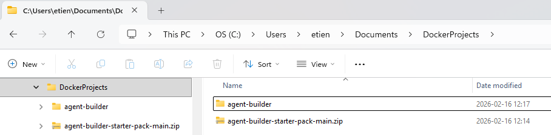
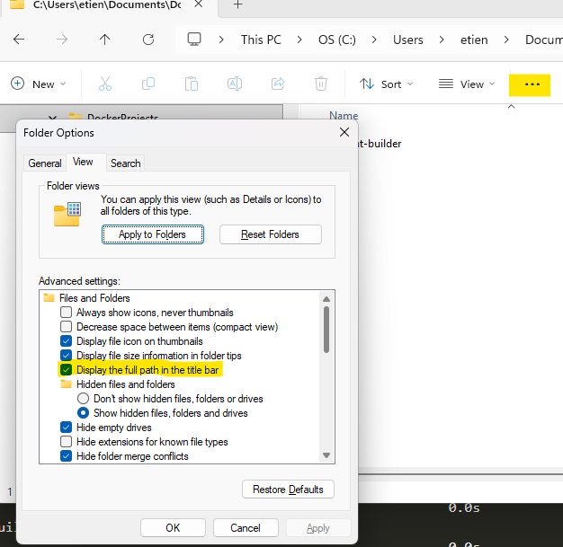
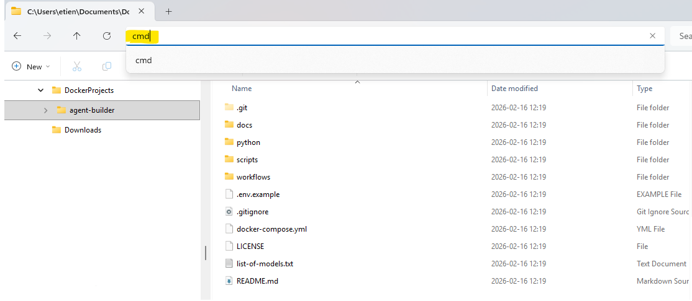
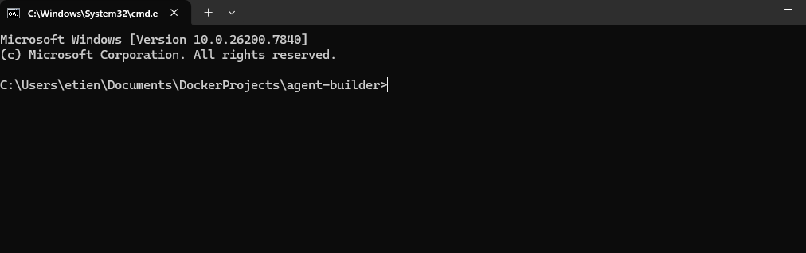
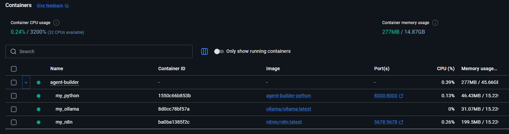
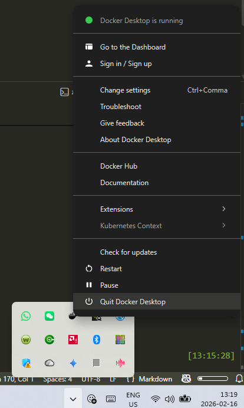

# Agent Builder Setup Instructions for Windows

> **WORK IN PROGRESS**


All files and information required are in the github repo [Agent Builder Starter Pack](https://github.com/2diyai/agent-builder-starter-pack/)

## 1. Create the project folder
### Option 1 (easy)
- Select a work folder (e.g. `C:\Users\<username>\Documents\DockerProjects`)
- Download the zip including all required files into it. Click [here](https://github.com/2diyai/agent-builder-starter-pack/archive/refs/heads/main.zip) to download.
- Unzip all files from the ZIP into this project folder
- Change the name into a convenient name (e.g. `agent-builder`)

    

### Option 2 (only if you are familiar with git)
- Clone the repository in a convenient place on your system with command:
    ```cmd
    git clone git@github.com:2diyai/agent-builder-starter-pack.git agent-builder
    ```

## 2. Install software
This will install all required software into their containers and set it up as a one system. It will install N8N and Ollama. It will also create some disk space to keep configurations, workflows and models locally when you stop Docker and relieve you from having to download them every time.

- open a terminal window in your project folder (top folder)
    - navigate into the project folder (`C:\Users\<username>\Documents\DockerProjects\agent-builder`)in File Explorer
    - if needed, turn on the path bar: ... > Options > "Display the full path in the title bar"

        

    - in the title  bar / path bar, enter `cmd`

        

    - a terminal window will open where you can enter commands

        


- enter and execute the following commands to setup the agent builder pack.
    ```cmd
        > scripts\setup.bat
    ```
- you should see something like, while N8N and Ollama are installed: 
    ```cmd
        Setting up in root directory: C:\Users\<username>\Documents\DockerProjects\agent-builder\
        [+] pull 3/3
        ✔ python                     Skipped No image to be pulled                 0.0s
        ✔ Image ollama/ollama:latest Pulled                                        4.1s
        ✔ Image n8nio/n8n:latest     Pulled                                        4.3s
        #1 [internal] load local bake definitions
        #1 reading from stdin 597B done
        #1 DONE 0.0s

        #2 [internal] load build definition from Dockerfile
        #2 transferring dockerfile: 258B done
        #2 DONE 0.0s

        #3 [internal] load metadata for docker.io/library/python:3.12-slim
        #3 DONE 1.0s
        ... 
        #9 [4/5] RUN pip install --no-cache-dir -r requirements.txt
        #9 2.966 Collecting fastapi==0.115.0 (from -r requirements.txt (line 2))
        ...
        #9 32.90 Downloading numpy-2.4.2-cp312-cp312-manylinux_2_27_x86_64.manylin ...
        #9 34.53    ━━━━━━━━━━━━━━━━━━━━━━━━━━━━━━━━━━━━━━━━ 16.6/16.6 MB 10.2 MB/s eta 0:00:00
        ...
        #9 40.04 Installing collected packages: typing-extensions, six, python-multipart, ...
        #9 DONE 48.8s

        #10 [5/5] COPY app ./app
        #10 DONE 0.2s

        #11 exporting to image
        #11 exporting layers
        #11 exporting layers 6.4s done
        ...
        #11 DONE 9.0s

        #12 resolving provenance for metadata file
        #12 DONE 0.0s
        [+] build 1/1
        ✔ Image agent-builder-python Built                                                                                60.4s
        Setup complete.
    ```
- When you see `Setup complete`, the installation is done.

### 2.2 Start N8N and Ollama
Before you can use N8N and Ollama you need to start the containers

- open a terminal window in your project folder (top folder)
- run the following command:
    ```cmd
        > scripts/start.bat
    ```
- you will see something like:
    ```cmd
        [+] up 6/6
        ✔ Network agent-builder_app_net    Created                     0.3s
        ✔ Volume agent-builder_n8n_data    Created                     0.0s
        ✔ Volume agent-builder_ollama_data Created                     0.0s
        ✔ Container my_python              Created                     0.2s
        ✔ Container my_ollama              Created                     0.2s
        ✔ Container my_n8n                 Created                     0.1s
        Services started.    
    ```
- when you see `Services Started`, N8N and Ollama are running. You can see it in the Docker Dashboard

    

### 2.3 Download models (once)
Ollama needs specific models to be downloaded to work. The file `list-of-models.txt` includes a list of a few models convenient to download.

See the full list of models on Ollama's webside [here](https://ollama.com/search)

> Note: the file downloaded are large (between 3 to 6 GB), it will take a long time.

To download all models in the list:
- open a terminal window in your project folder (top folder)
- run the following command:
    ```cmd
    scripts/download-models.bat
    ```
- you will see something like:
    ```cmd
    Pulling model: gemma3:4b
    pulling manifest 
    pulling aeda25e63ebd: 100% ▕██████████████████▏ 3.3 GB                         
    pulling e0a42594d802: 100% ▕██████████████████▏  358 B                         
    pulling dd084c7d92a3: 100% ▕██████████████████▏ 8.4 KB                         
    pulling 3116c5225075: 100% ▕██████████████████▏   77 B                         
    pulling b6ae5839783f: 100% ▕██████████████████▏  489 B                         
    verifying sha256 digest 
    writing manifest 
    success 
    Model download complete.
    ```
- when you see `Model download complete`, the models are loaded.


### 2.4 Stop Agent Builder
When you are done using the agent builder, you can safely stop the containers and exit Docker. The file you have downloaded and the configurations you have worked on are saved on your hard drive and not lost.

- open a terminal window in your project folder (top folder)
- run the following command:
    ```cmd
        > scripts/stop.bat
    ```
- you will see something like:
    ```cmd
    [+] up 4/4
    ✔ Network n8n-ollama-dev_app_net Removed                               0.3s
    ✔ Container my_ollama            Removed                               0.2s
    ✔ Container my_python            Removed                               0.2s
    ✔ Container my_n8n               Removed                               0.1s
    Services stopped.
    ```
- when you see `Services stopped`, N8N and Ollama are stopped and the container are removed.

### 2.5 Quit Docker
When you close the Docker Dashboard windows, you are not quitting Docker, but only minimizing it. You do not need to keep it active, though.

To quit Docker when you are done:
- identify the docler icon in the system tray
- right click on it
- click on "Quit Docker Desktop"

    
