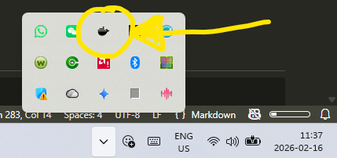

# Work with the Agent Builder

Before you can use N8N and Ollama you need to start the containers. Follow these instructions to start and stop the container.


## 1. Docker
Docker Desktop must be open to run the Agent Builder app/containers.

- Open Docker Desckop and keep it open for the duration of your work with Agent Builder
- Go to the project folder in your file explorer (windows) or file finder (macOS)

## 2. Start the containers

- open a terminal window in your project folder (top folder)

- run the following command (macOS, linux):
    ```shell
    ./scripts/start.sh
    ```
- run the following command (Windows):
    ```shell
    scripts\start.bat
    ```
- you will see something like in your terminal window:
    ```shell
    [+] up 4/4
    ✔ Network n8n-ollama-dev_app_net Created                               0.3s
    ✔ Container my_ollama            Created                               0.2s
    ✔ Container my_python            Created                               0.2s
    ✔ Container my_n8n               Created                               0.1s
    Services started.
    ```
- when you see `Services Started`, N8N and Ollama are running

## 3. Use N8N in the browser
Open the following page in your browser: [localhost:5678](http://localhost:5678/)

You can now use N8N graphical GUI to create workflows.

Reference workflows in the folder `workflows` can be imported

## 4 Stop Agent Builder
When you are done using the agent builder, you can safely stop the containers and exit Docker. The file you have downloaded and the configurations you have worked on are saved on your hard drive and will not be lost.

- open a terminal window in your project folder (top folder)
- run the following command (macOS, linux):
    ```shell
    ./scripts/stop.sh
    ```
- run the following command (Windows):
    ```shell
    scripts\stop.sh
    ```
- you will see something like:
    ```shell
    [+] up 4/4
    ✔ Network n8n-ollama-dev_app_net Removed                               0.3s
    ✔ Container my_ollama            Removed                               0.2s
    ✔ Container my_python            Removed                               0.2s
    ✔ Container my_n8n               Removed                               0.1s
    Services stopped.
    ```
- when you see `Services stopped`, N8N and Ollama are stopped and the container are removed.

## 5. Exit Docker
- Now you can close docker. 
- Clicking on the `x` will normally only minimise the window
- To really close Docker, identify the docker icon in your system tray

     

- Right click on the icon
- Select `Quit Docker Descktop` to quit the application
- Select `Go to the Dashboard` to open the window
